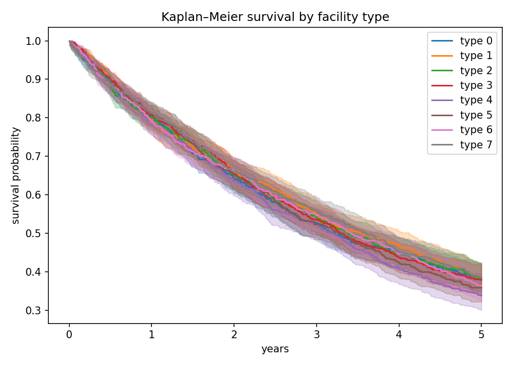
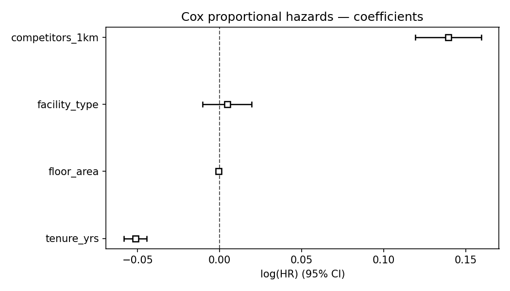
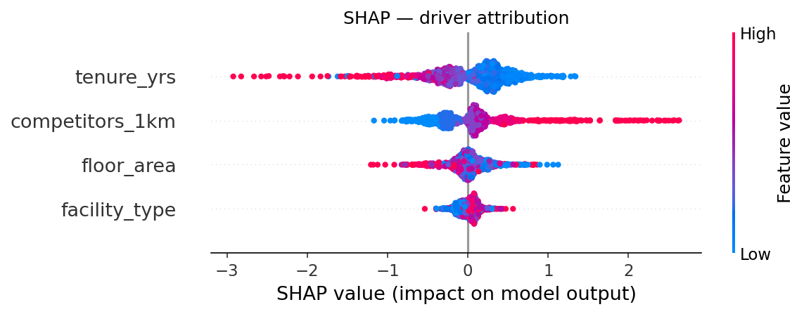
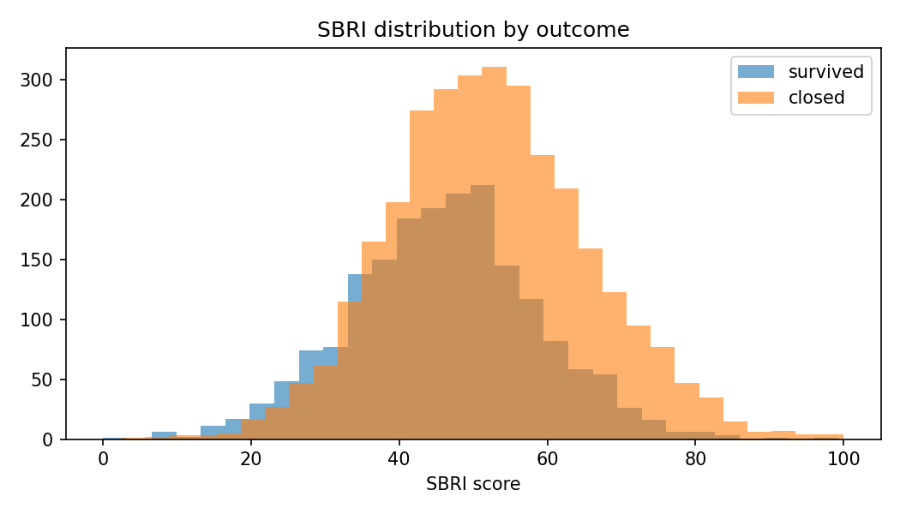

# Chaewon Ha (하채원) — Research Portfolio

Policy researcher and Ph.D. candidate working at the intersection of
**administrative data, survival analysis, interpretable machine learning,
local-service infrastructure risk, and human-centered manufacturing systems.**

I translate field and biomechanical intuition into reproducible computational
models, and turn analysis into decision tools for policy and industry.

---

## Featured project
### Early Warning of Closure Risk in Neighborhood Sports Facilities

An early-warning model that estimates closure risk for neighborhood sports
facilities and identifies its drivers, so local governments can intervene
before service gaps appear.

**Pipeline:** synthetic data → Cox PH → tree ensembles (RF / XGBoost) →
SHAP attribution → SBRI composite ranking

→ Code & notebook: [local-infrastructure-closure-risk](https://github.com/anna90nana-lang/local-infrastructure-closure-risk)

> All figures below are produced on **synthetic data** that mirrors the
> structure of administrative records. No real or personal data is used.

#### 1. Survival curves (Kaplan–Meier)
How facility survival declines over time, by facility type.

#### 2. Interpretable hazard (Cox PH)
Direction and magnitude of each driver's effect on closure hazard.

#### 3. Driver attribution (SHAP)
Which features drive predicted closure risk, and how.

#### 4. Operational risk index (SBRI)
A transparent composite score separating higher- and lower-risk facilities.

---

## Methods & tools
`Python` · `lifelines` (Cox PH) · `scikit-learn` · `XGBoost` · `SHAP` ·
`pandas` · `GeoPandas` · `SPSS / AMOS`

Survival analysis · interpretable ML · composite risk indices ·
spatial competition analysis · policy evaluation

---

## Other work (in progress)
- `sbri-dashboard-demo` — spatial risk index & early-warning dashboard (mock-up)
- `manufacturing-automation-readiness` — workforce / skill data for automation readiness (synthetic)

## Contact
GitHub: [@anna90nana-lang](https://github.com/anna90nana-lang)
